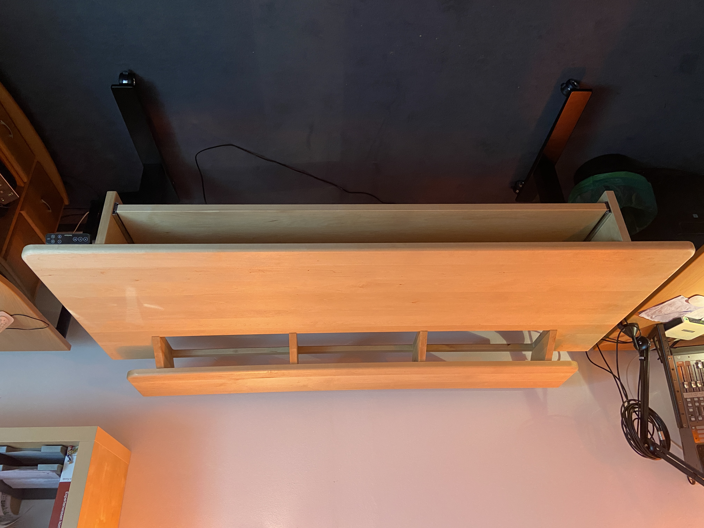
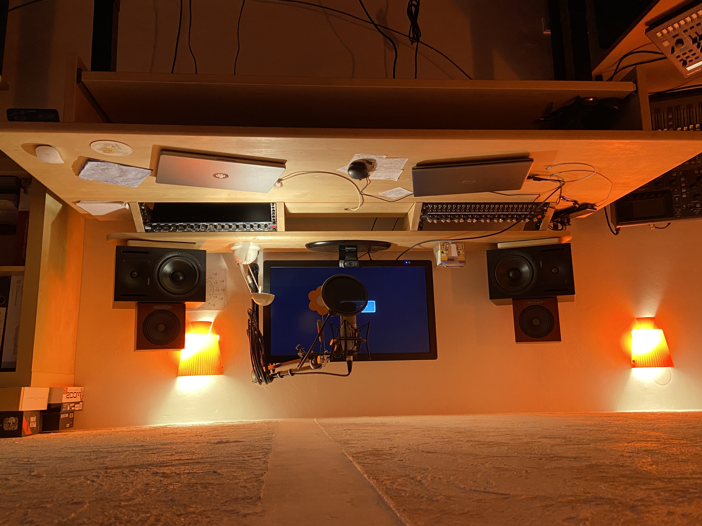
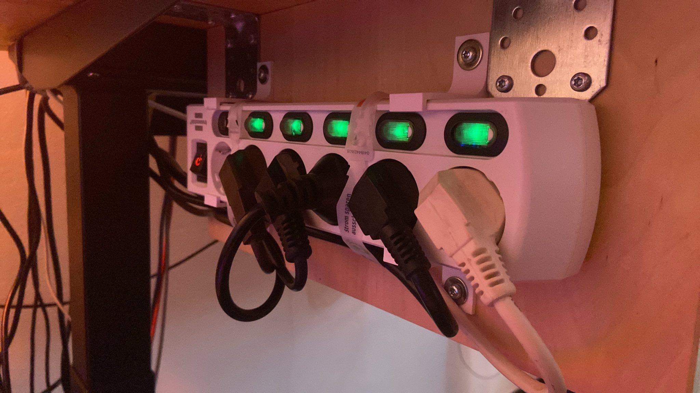

This repository contains all recources and designfiles use to build your own Studio Desk.
The main features of the desk are:
 * height adjustable
 * Up to 9 HE for 19" rack gear
 * Second layer for video and audio monitors
 * Dragable keyboard tray for up to 1500mm wide keyboards
 * huge table real estate (2000mm width, up to 800mm depth) to place laptops and studio gadgets

This is how it looks like:

The table is built on a Flexispot E7 Pro height adjustable standing frame which can carry up to 160kg. All wooden parts were cut from 2 slides of birch wood (2000mm x 800mm) from a local hardware store.

The design files are located in the [design](design) folder. Related pdf files in the [pdf](pdf) folder. They do also contain a cut plan.

For mounting 19" gear, I am using Adam Hall 3U rack mount kits. Please find the BOM at [Adam Hall Rack Mount Parts](rackmount/AdamHall_3URackMounts.md).

A few 3D parts were also designed and printed:
 * A [Rack Spacer](3Dprint/RackSpacer-Body.stl) to mount the rack mounts at equal depth from the slope edges
 * A [Power Plug Holder](3Dprint/PowerPlugHolder-PowerPlugHolder.stl) to mount the switchable power plug on the left side of the keyboard tray side 
 * A set of plate holders to use one of the cut pieces from the main table as cable cable guide through a cetre hole (see picture #2)

I would be pleased to see if someone uses this idea for their own DIY purpose. Have fun with it and send me your pictures! :-)